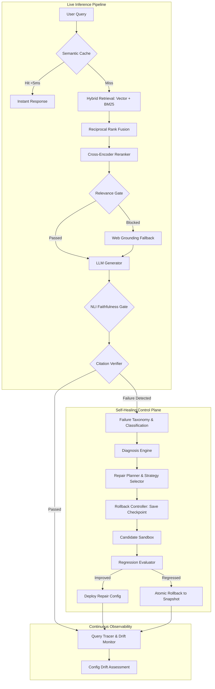

# 🛡️ Self-Healing RAG Engine

<div align="center">


-00F076?style=for-the-badge)


**Autonomous AI Infrastructure Engine for Production Retrieval-Augmented Generation**  
*Evaluates pipeline quality, classifies failures, diagnoses root causes, executes sandboxed candidate repairs, regression tests changes, and autonomously deploys or rolls back configuration in real-time.*

[Architecture](#-architecture) • [Core Capabilities](#-core-capabilities) • [Failure Taxonomy](#-failure-taxonomy) • [Repair Strategies](#-repair-strategies) • [API Specification](#-api-specification) • [Quickstart](#-quickstart) • [Production Hosting](#-production-hosting)

</div>

---

## 🎯 Product Vision

Traditional RAG deployments fail silently: semantic search misses domain jargon, models hallucinate unsupported claims, citation markers misalign with source chunks, and hyperparameter drift degrades retrieval recall over time.

The **Self-Healing RAG Engine** acts as an autonomous reliability control plane for RAG pipelines:
1. **Executes Dual-Path RAG**: High-precision hybrid retrieval (Dense Vector + BM25Okapi fused via Reciprocal Rank Fusion) with Cross-Encoder reranking.
2. **Tri-Guardrail Quality Auditing**: Real-time evaluation of relevance, NLI-entailed faithfulness, and citation validity before returning responses.
3. **Multi-Dimensional Failure Classification**: Automatically detects and categorizes retrieval, grounding, generation, citation, latency SLA, and configuration drift failures.
4. **Autonomous Root Cause Diagnosis**: Infers underlying pipeline bottlenecks using heuristic reasoning chains.
5. **Sandboxed Candidate Repair**: Clones configurations, generates repair candidate permutations, and benchmark-evaluates them in isolation without touching live traffic.
6. **Zero-Regression Deployment Gate**: Compares before-and-after metrics; only promotes repairs that improve overall quality and meet latency SLAs.
7. **Atomic SQLite Checkpoints & Rollback**: Instantly restores previous healthy configuration states upon any detected quality regression.

---

## 🏗️ Architecture



---

## ⚡ Core Capabilities

### 1. Dual-Path Hybrid Retrieval & Reranking
Combines dense semantic representations (`sentence-transformers/all-MiniLM-L6-v2`) with sparse exact-match statistics (Okapi BM25) fused dynamically via Reciprocal Rank Fusion ($k=60$):
$$\text{RRF Score}(d) = \frac{w_{\text{vector}}}{k + r_{\text{vector}}(d)} + \frac{w_{\text{bm25}}}{k + r_{\text{bm25}}(d)}$$
Followed by joint query-document cross-encoder attention scoring (`cross-encoder/ms-marco-MiniLM-L6-v2`).

### 2. Multi-Dimensional Failure Taxonomy
Classifies runtime failures into six canonical categories with severity ratings (`CRITICAL`, `HIGH`, `MEDIUM`, `LOW`, `INFO`):
- **Retrieval Failure**: Low relevance score ($< \theta_{\text{rel}}$) or zero matching context chunks.
- **Grounding Failure**: Generated answer fails NLI premise entailment ($< \theta_{\text{faith}}$).
- **Generation Failure**: Provider API timeouts, rate-limits, or empty generations.
- **Citation Failure**: Source citation indices outside context boundaries.
- **Latency Failure**: Pipeline execution time exceeds SLA ($\text{latency} > \text{SLA}_{\text{ms}}$).
- **Configuration Drift**: Systemic degradation detected across aggregate telemetry logs.

### 3. Rule-Based Diagnosis Engine
Analyzes failure evidence chains to determine root cause and suggest prioritized candidate repair strategies:
- Query vocabulary gap vs parameter misalignment
- Context window overflow vs excessive LLM temperature
- Aggressive relevance gating vs inadequate retrieval depth

### 4. Seven Concrete Repair Strategies
Every strategy implements the `BaseRepairStrategy` interface with isolated execution and rollback capabilities:
1. `rewrite_query`: Reformulates user search query via semantic rewriter.
2. `adjust_retrieval`: Dynamically mutates $w_{\text{vector}}$, $w_{\text{bm25}}$, $k_{\text{rrf}}$, and $k_{\text{retrieval}}$.
3. `adjust_thresholds`: Calibrates $\theta_{\text{relevance}}$ and $\theta_{\text{faithfulness}}$ against observed distributions.
4. `expand_context`: Increases rerank window and enables live web search grounding fallback.
5. `rechunk_documents`: Alters chunk size and chunk overlap parameters.
6. `swap_reranker`: Switches reranking models or alters top-k rerank bounds.
7. `regenerate`: Retries LLM generation with strict constraint system prompts (`STRICT_RAG_SYSTEM_PROMPT`) and lowered temperature.

### 5. Candidate Sandbox & Regression Evaluator
Candidates are cloned and evaluated against regression test suites. The regression evaluator calculates multi-metric deltas ($\Delta_{\text{faithfulness}}$, $\Delta_{\text{relevance}}$, $\Delta_{\text{latency}}$) and computes a weighted composite quality score.
- **DEPLOY**: Quality improves by $\ge 2\%$ with no SLA violations.
- **ROLLBACK**: Quality degrades or latency regresses beyond safety margins.
- **NEUTRAL**: Negligible impact; rollback executed to preserve stability.

---

## 📡 API Specification

| Method | Endpoint | Description |
|---|---|---|
| `GET` | `/` | Engine status and version banner |
| `GET` | `/health` | Core health check, active provider, and hyperparameter snapshot |
| `POST` | `/ingest` | Ingest and index documents from disk directory |
| `POST` | `/ingest/upload` | Multipart file upload and immediate on-the-fly indexing |
| `POST` | `/query` | Primary RAG inference endpoint with real-time guardrails and query rewrite |
| `GET` | `/engine/status` | Comprehensive engine status, health score, and checkpoint history |
| `POST` | `/engine/heal` | Autonomous HealLoop execution (diagnose, sandbox, repair, deploy/rollback) |
| `GET` | `/engine/telemetry` | Aggregated inference telemetry, latency percentiles, and heal event logs |
| `GET` | `/engine/drift` | Real-time configuration drift assessment against failure taxonomy |
| `GET` | `/engine/checkpoints` | List recent SQLite configuration snapshots |
| `POST` | `/engine/checkpoints/restore` | Atomic rollback to a specific historical checkpoint |
| `POST` | `/engine/auto-tune` | Autonomous hyperparameter mutation based on telemetry drift |
| `GET` | `/evolution/status` | Hyperparameter version history and parameter generation details |
| `POST` | `/evolution/synthetic-train` | Generate synthetic QA evaluation pairs from indexed documents |
| `POST` | `/evolution/audit-rag` | Audit external RAG code/configurations and generate upgrade recipes |

---

## 🚀 Quickstart

### 1. Prerequisites
- Python 3.12+ (Python 3.14 compatible)
- Git

### 2. Installation
```bash
# Clone the repository
git clone https://github.com/Rishigit222/S-r-h.git
cd S-r-h

# Create and activate virtual environment
python -m venv .venv
source .venv/bin/activate    # Linux / macOS
.\.venv\Scripts\activate     # Windows PowerShell

# Install dependencies
pip install -r requirements.txt
```

### 3. Configuration
Copy the sample environment file and select your preferred LLM provider:
```bash
cp .env.example .env
```
Supported providers:
- **`ollama`** (default, local, zero API keys required): runs via `http://localhost:11434`
- **`groq`** (fast cloud inference): set `GROQ_API_KEY`
- **`google`** (Google AI Studio Gemini): set `GOOGLE_API_KEY`

### 4. Ingest Documents
Place your `.txt`, `.md`, or `.pdf` files into `data/sample_docs/`, then run:
```bash
make ingest
```

### 5. Run the Automated Test Suite
```bash
pytest tests/ -v
```
All 42 tests should pass:
```
tests/test_api_engine.py ........                                        [ 19%]
tests/test_engine.py ..................                                  [ 61%]
tests/test_evolution.py ......                                           [ 76%]
tests/test_guardrails.py ....                                            [ 85%]
tests/test_retrieval.py ...                                              [ 92%]
tests/test_sarah.py .                                                    [ 95%]
tests/test_super_rag.py ..                                               [100%]
================= 42 passed in 112s ==================
```

### 6. Run the End-to-End Self-Healing Demo
```bash
python scripts/test_heal_pipeline.py
```

### 7. Start the Engine API
```bash
make run-api
# API will be live at http://127.0.0.1:8000
# Interactive OpenAPI Docs: http://127.0.0.1:8000/docs
```

---

## 🐳 Production Hosting

### Option A: Docker Deployment (Recommended)

Build and run the production container:
```bash
# Build the container
docker build -t self-healing-rag:latest .

# Run with environment file and volume persistence
docker run -d \
  --name self-healing-rag \
  -p 8000:8000 \
  --env-file .env \
  -v $(pwd)/data:/app/data \
  self-healing-rag:latest
```

### Option B: Docker Compose

```bash
docker compose up -d
```

### Option C: Systemd / Bare-Metal Production
Run with multiple uvicorn worker processes:
```bash
uvicorn src.api.main:app --host 0.0.0.0 --port 8000 --workers 4
```

---

## 📊 Evaluation Benchmark

Run quality benchmark evaluations against the golden dataset:
```bash
python -m src.evaluation.eval_runner
```
Outputs composite health scoring, refusal accuracy, inline citation coverage, and latency metrics.

---

## 📜 License

Licensed under the Apache License, Version 2.0.
