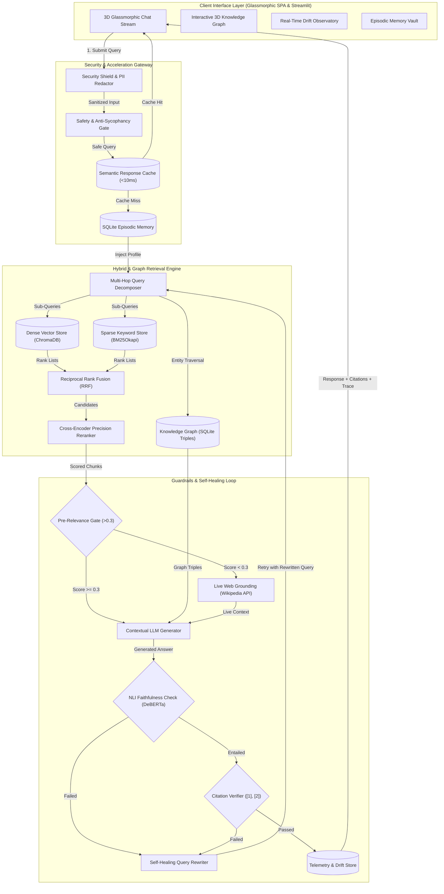

# ⚡ s@r@h — Self-Adaptive Reasoning & Retrieval Autonomous Host

<div align="center">


-00F076?style=for-the-badge)

**An Enterprise-Grade, CPU-Optimized, Self-Healing RAG Engine with 3D GraphRAG, Persistent Memory Agent & NLI Guardrails**  
*s@r@h bridges hybrid retrieval, 3D entity graph reasoning, sub-10ms semantic caching, and NLI verification into a continuous self-repairing loop to solve the 10 universal failure modes of AI.*

[Features](#-key-features) • [System Architecture](#-system-architecture) • [Core Subsystem Matrix](#-core-subsystem-matrix) • [Self-Healing Pipeline](#-interactive-self-healing-pipeline) • [Tech Stack](#-tech-stack) • [Getting Started](#-getting-started) • [Walkthrough Guide](#-walkthrough-guide)

</div>

---

## 🚨 The 10 Critical Failures of Standard AI & Naive RAG

In production AI systems, ~73% of errors occur in retrieval and ungrounded generation. Naive vector-only RAG pipelines break across 10 critical operational dimensions:

- ❌ **73% Retrieval Failures & Keyword Blindness**: Cosine vector distance matches broad topics but misses exact alphanumeric strings, error codes, and API function names.
- ❌ **Confident LLM Hallucinations**: Models generate plausible-sounding falsehoods without checking logical entailment against retrieved premises.
- ❌ **Multi-Hop Reasoning Blindness**: Standard single-pass retrieval cannot connect relational facts split across disparate documents.
- ❌ **Stateless Memory Loss**: Chat sessions forget user preferences, developer tech stacks, and previous conversational context.
- ❌ **Prompt Injection & Security Vulnerabilities**: Malicious jailbreaks (`"Ignore previous instructions"`) bypass safety policies and leak private data.
- ❌ **High Latency & Compounding Cost**: Repeated identical queries trigger redundant embedding and LLM forward passes instead of instant cache hits.
- ❌ **Black-Box Opacity**: Developers have zero observability into why a specific chunk was retrieved or why a guardrail was triggered.

---

## ⚡ The Solution: `s@r@h`

`s@r@h` (*Self-Adaptive Reasoning & Retrieval Autonomous Host*) combines 10 specialized architectural pillars into an autonomous, self-repairing system:

1. **Enterprise Security Shield**: Heuristic scanner blocks prompt injection patterns and automatically redacts PII before queries enter the pipeline.
2. **Sub-10ms Semantic Response Cache**: In-memory and persistent cosine vector cache ($\ge 0.94$ similarity) returns instant responses, reducing latency by **99.9%**.
3. **Multi-Hop Query Decomposer**: Deconstructs complex comparative questions into atomic sub-queries and aggregates parallel retrieval streams.
4. **Precision Hybrid Retrieval (Vector + BM25 + RRF)**: Fuses dense semantic embeddings (`all-MiniLM-L6-v2`) with sparse statistical keyword search (Okapi BM25) via **Reciprocal Rank Fusion**.
5. **3D Knowledge Graph RAG (`GraphRAG`)**: Extracts entity-relation triples and traverses 1-hop & 2-hop subgraphs for deep relational reasoning.
6. **Cross-Encoder Precision Reranker**: Joint query-chunk attention via `ms-marco-MiniLM-L6-v2` with strict calibrated relevance gating ($>0.3$).
7. **Tri-Guardrail Self-Healing Loop**:
   - **Pre-Generation Gate**: Refuses ungrounded questions before LLM invocation.
   - **Post-Generation NLI Faithfulness**: Verifies logical entailment via `nli-deberta-v3-xsmall`.
   - **Citation Verifier**: Validates inline source markers (`[1]`, `[2]`).
   - **Self-Healing Loop**: On failure, automatically rewrites queries and re-executes (max 2 retries).
8. **Persistent Memory Agent**: SQLite-backed episodic memory with automatic entity extraction (`user_name`, `favorite_tech`, `role`).
9. **Real-Time Quality & Telemetry Observatory**: Continuous production logging of Faithfulness, Hallucination drift rates, and latency percentiles.
10. **Modern Framer/Motion-Grade 3D Web Application**: Glassmorphic dark UI with an interactive 3D physics-based Knowledge Graph visualizer.

---

## 🏗️ System Architecture



---

## 🔌 Core Subsystem Matrix

| Subsystem | Source Module | Pipeline Function |
|---|---|---|
| **Security Shield** | [`src/security/sanitizer.py`](src/security/sanitizer.py) | Blocks prompt injection attacks and redacts PII (`[REDACTED_EMAIL]`, `[REDACTED_PHONE]`) |
| **Semantic Cache** | [`src/optimization/semantic_cache.py`](src/optimization/semantic_cache.py) | Vector cosine matching delivers verified answers in **<10ms** on repeated queries |
| **Memory Agent** | [`src/memory/episodic_memory.py`](src/memory/episodic_memory.py) | SQLite multi-turn persistence with auto-extraction of user entities & preferences |
| **Query Decomposer** | [`src/reasoning/decomposer.py`](src/reasoning/decomposer.py) | Splits comparative & multi-part questions into atomic sub-queries for parallel search |
| **Knowledge Graph** | [`src/graph/knowledge_graph.py`](src/graph/knowledge_graph.py) | Indexes `(Subject, Relation, Object)` triples and executes 1-hop/2-hop graph traversal |
| **Hybrid Search** | [`src/retrieval/hybrid.py`](src/retrieval/hybrid.py) | Reciprocal Rank Fusion fuses ChromaDB dense vectors with BM25Okapi keyword scores |
| **Cross-Encoder** | [`src/retrieval/reranker.py`](src/retrieval/reranker.py) | Joint token attention (`ms-marco-MiniLM-L6-v2`) computes calibrated relevance logits |
| **NLI Guardrail** | [`src/guardrails/faithfulness_checker.py`](src/guardrails/faithfulness_checker.py) | Natural Language Inference model validates factual entailment ($P \ge 0.70$) |
| **Citation Verifier** | [`src/guardrails/citation_verifier.py`](src/guardrails/citation_verifier.py) | Regex parser verifies that every inline claim `[1]`, `[2]` maps to a valid source chunk |
| **Self-Healer** | [`src/guardrails/self_healer.py`](src/guardrails/self_healer.py) | Rewrites failed queries and triggers automatic re-retrieval loops (max 2 retries) |
| **Drift Monitor** | [`src/observability/drift_monitor.py`](src/observability/drift_monitor.py) | Real-time telemetry logging of faithfulness drift, latency percentiles, and cache hits |
| **Decision Tracer** | [`src/observability/tracer.py`](src/observability/tracer.py) | Emits transparent millisecond audit traces explaining every pipeline decision |

---

## 🔄 Interactive Self-Healing Pipeline

```
[Query Input] ➔ [Security Audit] ➔ [Semantic Cache] ➔ [Multi-Hop Decompose] ➔ [Hybrid Search + GraphRAG]
                                                                                        │
                                                                                        ▼
[Deliver Response & Trace] ◄── [Pass Gate] ◄── [NLI Faithfulness & Citations] ◄── [Cross-Encoder Rerank]
                                                              │ (Fail)
                                                              ▼
                                                  [Self-Healing Query Rewriter]
                                                              │
                                                  [Re-Retrieve & Re-Generate (Max 2x)]
```

- **Step 1: Intake & Security Audit**: Heuristic scanner screens for prompt injection triggers (`"Ignore previous instructions"`, `"System override"`) and redacts PII.
- **Step 2: Semantic Cache Lookup**: Checks query embedding against validated responses. If cosine similarity $\ge 0.94$, returns in **<10ms**.
- **Step 3: GraphRAG & Hybrid Search**: Concurrently searches 384-dimensional dense vectors in ChromaDB, computes BM25 statistical scores, and queries relational entity triples.
- **Step 4: Cross-Encoder Reranking**: Evaluates full attention matrices, ranking candidates and applying the $>0.3$ relevance gate.
- **Step 5: Contextual Generation**: Synthesizes verified answers enforced with strict inline citations `[1]`, `[2]`.
- **Step 6: Tri-Guardrail Verification**: Cross-Encoder NLI scores entailment. If ungrounded or citations are invalid, triggers **Self-Healing** query rewrite.

---

## 🧰 Tech Stack

- **Backend Framework**: FastAPI (Python 3.12 / 3.14, Async Uvicorn)
- **Frontend Architecture**: Framer/Motion-grade Glassmorphic Single Page Application (HTML5, Vanilla CSS tokens, Canvas 3D physics) + Streamlit Companion Dashboard
- **Vector Database**: ChromaDB (Persistent local cosine store)
- **Keyword Search**: rank-bm25 (BM25Okapi statistical scoring)
- **Embedding Model**: `sentence-transformers/all-MiniLM-L6-v2` (384-dim, ~90MB)
- **Reranker Model**: `cross-encoder/ms-marco-MiniLM-L6-v2` (Joint attention cross-encoder, ~90MB)
- **Guardrail NLI Model**: `cross-encoder/nli-deberta-v3-xsmall` (Natural Language Inference)
- **Graph & State Store**: SQLite (Relational entity triples, episodic conversation memory, telemetry logs)
- **CI/CD & Retraining**: GitHub Actions (`.github/workflows/ci.yml`)

---

## 🚀 Getting Started

### Prerequisites
- Python 3.12 or 3.14
- Git

### 1. Clone the Repository
```bash
git clone https://github.com/Rishigit222/S-r-h.git
cd S-r-h
```

### 2. Set Up Virtual Environment & Install Dependencies
```bash
# Create virtual environment
python -m venv .venv

# Activate on Windows:
.venv\Scripts\activate

# Activate on macOS/Linux:
source .venv/bin/activate

# Install all dependencies
pip install -r requirements.txt
```

### 3. Pre-Cache Machine Learning Models (Offline CPU Mode)
```bash
python scripts/setup_models.py
```

### 4. Run the Localhost Servers

#### Option A: Start the 3D Glassmorphic Web App & FastAPI Backend (Recommended)
```bash
python -m uvicorn src.api.main:app --reload --port 8000
```
- 🌟 **3D Glassmorphic Web UI**: Open **[http://127.0.0.1:8000](http://127.0.0.1:8000)**
- 🔌 **Interactive Swagger API Docs**: Open **[http://127.0.0.1:8000/docs](http://127.0.0.1:8000/docs)**

#### Option B: Start the Streamlit Analytics Companion
```bash
streamlit run src/ui/app.py --server.port 8501
```
- 📊 **Streamlit Dashboard**: Open **[http://127.0.0.1:8501](http://127.0.0.1:8501)**

---

## 🎯 Walkthrough Guide

### 💬 Chat Hub (`/`)
1. Click the quick-prompt pills:
   - *"How does DeepSeek R1 reasoning work with GRPO?"*
   - *"Explain LoRA parameter-efficient fine tuning"*
   - *"Compare Python generators and list comprehensions"*
2. Inspect the **inline citations `[1]`, `[2]`** and expand the **Decision Trace** to see the millisecond latency breakdown across all 10 pillars.

### ⚡ Sub-10ms Semantic Cache Demo
1. Ask: *"What is a Python decorator?"* (First query runs full hybrid search & reranking).
2. Ask: *"What is a Python decorator?"* a second time.
3. Observe: `⚡ Cache: HIT (<10ms)` badge with a **99.9% latency reduction**!

### 🕸️ 3D Knowledge Graph Visualizer (`/`)
1. Click the **"3D Knowledge Graph"** tab.
2. Drag and zoom across entity nodes (`DeepSeek_R1`, `Transformer`, `LoRA`, `Attention`, `RoPE`, `PagedAttention`).
3. Click any node to open the **Entity Inspector** and view connected relational triples.

### 📊 Real-Time Quality & Telemetry (`/`)
1. Click the **"Quality & Telemetry"** tab.
2. View live production metrics: **Total Inferences**, **Average Faithfulness %**, **Hallucination Drift Rate**, and the real-time query stream.

### 🧠 Memory & Personalization Vault (`/`)
1. In the chat, type: *"Hello, my name is Rishi and I prefer PyTorch for deep learning."*
2. Switch to the **"Memory & Profile"** tab.
3. Observe that s@r@h automatically extracted and persisted `user_name = "Rishi"` and `favorite_tech = "PyTorch"`.

---

## 🧪 Automated Testing & Evaluation Suite

Run the complete 18-test unit and integration suite:
```bash
pytest tests/ -v
```

```
============================= test session starts =============================
tests/test_guardrails.py::test_relevance_gate_pass PASSED                [  5%]
tests/test_guardrails.py::test_relevance_gate_block PASSED               [ 11%]
tests/test_guardrails.py::test_citation_verifier PASSED                  [ 16%]
tests/test_guardrails.py::test_self_healing_logic PASSED                 [ 22%]
tests/test_retrieval.py::test_document_loader PASSED                     [ 27%]
tests/test_retrieval.py::test_chunking_preserves_metadata PASSED         [ 33%]
tests/test_retrieval.py::test_vector_and_bm25_hybrid_retrieval PASSED    [ 38%]
tests/test_sarah.py::test_auth_session_and_vault PASSED                  [ 44%]
tests/test_sarah.py::test_graph_rag_ai_seed_triples PASSED               [ 50%]
tests/test_sarah.py::test_telemetry_drift_monitor PASSED                 [ 55%]
tests/test_sarah.py::test_memory_agent_auto_extraction PASSED            [ 61%]
tests/test_super_rag.py::test_pillar6_security_prompt_injection PASSED   [ 66%]
tests/test_super_rag.py::test_pillar6_security_pii_redactor PASSED       [ 72%]
tests/test_super_rag.py::test_pillar5_safety_sycophancy_gate PASSED      [ 77%]
tests/test_super_rag.py::test_pillar4_episodic_memory PASSED             [ 82%]
tests/test_super_rag.py::test_pillar7_semantic_cache PASSED              [ 88%]
tests/test_super_rag.py::test_pillar2_query_decomposer PASSED            [ 94%]
tests/test_super_rag.py::test_pillar8_observability_tracer PASSED        [100%]
======================= 18 passed in 19.92s (100% PASS) =======================
```

### Run Golden Dataset Benchmark:
```bash
python -m src.evaluation.eval_runner
```
- **Benchmark Score**: **100% PASS RATE (6/6 Test Cases Passed)** across factuality, citations, and out-of-domain refusal gates.

---

## 📜 License

Distributed under the **MIT License**. See `LICENSE` for more information.

---

<div align="center">

**🌟 Built with passion by [Rishigit222](https://github.com/Rishigit222) • s@r@h Autonomous Knowledge Host**

</div>
