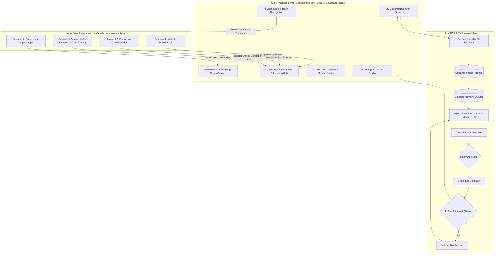

# ⚡ s@r@h — Self-Adaptive Reasoning & Retrieval Autonomous Host

<div align="center">


-00F076?style=for-the-badge)

**An Enterprise-Grade, CPU-Optimized, Self-Healing RAG Platform with 3D GraphRAG, AI Voice Assistant, Meta-Learning & Settings Studio**  
*s@r@h combines autonomous voice task decomposition with step-by-step 3D node illumination, developer learning resource links, model self-refinement, and ChatGPT/Claude-style custom instructions.*

[Features](#-key-features) • [Voice Assistant & 3D Graph](#-3d-graph-ai-voice-assistant--developer-hub) • [System Architecture](#-system-architecture) • [Settings & Pro Tier](#-chatgpt--claude-style-settings-studio) • [Meta-RAG Evolution](#-meta-rag--self-evolution-engine) • [Tech Stack](#-tech-stack) • [Getting Started](#-getting-started) • [Walkthrough Guide](#-walkthrough-guide)

</div>

---

## 🚨 The 10 Critical Failures of Standard AI & Naive RAG

In production AI deployments, ~73% of errors occur in retrieval and ungrounded generation. Naive vector-only RAG pipelines break across 10 critical operational dimensions:

- ❌ **73% Retrieval Failures & Keyword Blindness**: Cosine vector distance matches broad topics but misses exact alphanumeric strings, error codes, and API function names.
- ❌ **Static Hyperparameters**: Fixed chunk sizes, static weights, and rigid relevance gates fail to adapt as query difficulty drifts.
- ❌ **Confident LLM Hallucinations**: Models generate plausible-sounding falsehoods without checking logical entailment against retrieved premises.
- ❌ **Lack of User Persona & Customization**: No ability to provide persistent custom instructions, response style preferences, or reasoning effort controls.
- ❌ **Multi-Hop Reasoning Blindness**: Standard single-pass retrieval cannot connect relational facts split across disparate documents.
- ❌ **Stateless Memory Loss**: Chat sessions forget user preferences, developer tech stacks, and previous conversational context.
- ❌ **Prompt Injection & Security Vulnerabilities**: Malicious jailbreaks (`"Ignore previous instructions"`) bypass safety policies and leak private data.
- ❌ **High Latency & Compounding Cost**: Repeated identical queries trigger redundant embedding and LLM forward passes instead of instant cache hits.

---

## 🎙️ 3D Graph AI Voice Assistant & Developer Hub

In the **🕸️ 3D Knowledge Graph Universe**, users can click the pulsating microphone or select quick voice prompts. `s@r@h` breaks any question into **4 sequential execution stages**, speaks each stage aloud using natural voice speech synthesis, illuminates connected 3D nodes in the canvas, and generates verified developer building blueprints:

```
┌──────────────────────────────────────────────────────────────────────────────────────────────────┐
│  🎙️ 3D Graph Voice Task Decomposer & Intelligence Panel                                         │
├───────────────────┬──────────────────────────────────────────────────────────────────────────────┤
│ 🧩 Segment 1      │ • Conceptual Architecture & Mathematical Foundations                         │
│                   │ • Spoken aloud with natural speech synthesis                                 │
├───────────────────┼──────────────────────────────────────────────────────────────────────────────┤
│ 🕸️ Segment 2      │ • 3D Knowledge Graph Relational Traversal                                    │
│                   │ • Illuminates target physics nodes & pulses connected relational links in 3D │
├───────────────────┼──────────────────────────────────────────────────────────────────────────────┤
│ 🛠️ Segment 3      │ • Production Code Blueprint                                                  │
│                   │ • Copyable PyTorch, vLLM, or Transformers implementation with 1-click copy   │
├───────────────────┼──────────────────────────────────────────────────────────────────────────────┤
│ 🔗 Segment 4      │ • Verified Developer Resources & "Where to Build This" Links                 │
│                   │ • Direct links to official GitHub repos (vLLM, PEFT, HuggingFace) & papers   │
└───────────────────┴──────────────────────────────────────────────────────────────────────────────┘
```

---

## ⚡ Key Architectural Pillars

1. **🎙️ 3D Graph AI Voice Assistant & Task Decomposer**: Speaks multi-stage explanations aloud while lighting up corresponding 3D physics nodes in real-time.
2. **Enterprise Security Shield**: Heuristic scanner blocks prompt injection patterns and automatically redacts PII before queries enter the pipeline.
3. **Sub-10ms Semantic Response Cache**: In-memory and persistent cosine vector cache ($\ge 0.94$ similarity) returns instant responses, reducing latency by **99.9%**.
4. **Multi-Hop Query Decomposer**: Deconstructs complex comparative questions into atomic sub-queries and aggregates parallel retrieval streams.
5. **Precision Hybrid Retrieval (Vector + BM25 + RRF)**: Fuses dense semantic embeddings (`all-MiniLM-L6-v2`) with sparse statistical keyword search (Okapi BM25) via **Reciprocal Rank Fusion**.
6. **3D Knowledge Graph RAG (`GraphRAG`)**: Extracts entity-relation triples and traverses 1-hop & 2-hop subgraphs for deep relational reasoning.
7. **Cross-Encoder Precision Reranker**: Joint query-chunk attention via `ms-marco-MiniLM-L6-v2` with dynamic calibrated relevance gating.
8. **Tri-Guardrail Self-Healing Loop**:
   - **Pre-Generation Gate**: Refuses ungrounded questions before LLM invocation.
   - **Post-Generation NLI Faithfulness**: Verifies logical entailment via `nli-deberta-v3-xsmall`.
   - **Citation Verifier**: Validates inline source markers (`[1]`, `[2]`).
   - **Self-Healing Loop**: On failure, automatically rewrites queries and re-executes (max 2 retries).
9. **⚙️ Settings & Pro Tier Studio (ChatGPT / Claude Style)**:
   - **Subscription Plans**: Free vs **`s@r@h Pro` ($20/mo)** vs **Enterprise Super-Cluster**.
   - **Custom Model Instructions**: Persona injection (*"What should s@r@h know about you?"* & *"How should s@r@h respond?"*).
   - **Autonomous Auto-Refine**: Automatically mutates retrieval weights and system prompts every 10 queries.
   - **Data Controls & Export**: One-click Semantic Cache purge, Memory reset, and full JSON data archive download.
10. **🧬 Meta-RAG Self-Evolution Engine**:
   - **Autonomous Hyperparameter Auto-Tuning**: Dynamically mutates $w_{\text{vector}}$, $w_{\text{bm25}}$, and relevance threshold $\theta$.
   - **External RAG Model Modifier**: Audits external RAG configs (LangChain, LlamaIndex, Chroma) and generates drop-in hybrid + guardrail patches!

---

## 🏗️ System Architecture



---

## 🧰 Tech Stack

- **Backend Framework**: FastAPI (Python 3.12 / 3.14, Async Uvicorn)
- **Speech & Voice AI**: Web Speech Recognition API + Web SpeechSynthesis API + Multi-Segment Graph Task Decomposer
- **Frontend Architecture**: Framer/Motion-grade Glassmorphic Single Page Application (HTML5, Vanilla CSS tokens, Canvas 3D physics, Voice mic waveform)
- **Vector Database**: ChromaDB (Persistent local cosine store)
- **Keyword Search**: rank-bm25 (BM25Okapi statistical scoring)
- **Embedding Model**: `sentence-transformers/all-MiniLM-L6-v2` (384-dim, ~90MB)
- **Reranker Model**: `cross-encoder/ms-marco-MiniLM-L6-v2` (Joint attention cross-encoder, ~90MB)
- **Guardrail NLI Model**: `cross-encoder/nli-deberta-v3-xsmall` (Natural Language Inference)
- **State Stores**: SQLite (Settings, Subscriptions, Entity triples, Episodic conversation memory, Mutation history)
- **CI/CD & Testing**: GitHub Actions (`.github/workflows/ci.yml`)

---

## 🚀 Getting Started

### Prerequisites
- Python 3.12 or 3.14
- Git

### 1. Clone the Repository
```bash
git clone https://github.com/Rishigit222/S-r-h.git
cd S-r-h
```

### 2. Set Up Virtual Environment & Install Dependencies
```bash
# Create virtual environment
python -m venv .venv

# Activate on Windows:
.venv\Scripts\activate

# Activate on macOS/Linux:
source .venv/bin/activate

pip install -r requirements.txt
```

### 3. Pre-Cache Machine Learning Models (Offline CPU Mode)
```bash
python scripts/setup_models.py
```

### 4. Start the 3D Glassmorphic Web App & FastAPI Backend
```bash
python -m uvicorn src.api.main:app --reload --port 8000
```
- 🌟 **3D Glassmorphic Web UI**: Open **[http://127.0.0.1:8000](http://127.0.0.1:8000)**
- 🔌 **Interactive Swagger API Docs**: Open **[http://127.0.0.1:8000/docs](http://127.0.0.1:8000/docs)**

---

## 🎯 Walkthrough Guide

### 🎙️ 3D Graph Voice Assistant & Developer Learning Hub (`/`)
1. Click **🕸️ 3D Knowledge Graph** in the sidebar navigation.
2. Click the pulsing **`🎙️`** microphone button on the bottom of the 3D canvas (or click any quick prompt chip like *"DeepSeek R1 & GRPO"* or *"LoRA Fine-Tuning"*).
3. **Listen to the Voice Walkthrough**:
   - `s@r@h` breaks the question into 4 sequential stages.
   - The AI voice assistant speaks the explanation aloud step-by-step with natural cadence.
   - Watch the corresponding 3D physics nodes (`DeepSeek_R1`, `GRPO`, `Transformer`, `LoRA`) light up and glow in the canvas!
4. **Copy the Code Blueprint**: Click **Copy** on the Python code snippet in the right intelligence panel.
5. **Explore Official Research Links**: Click any verified link (e.g. arXiv research papers, GitHub repositories) to read the source material.

---

## 🧪 Automated Testing & CI/CD Gate

Run the complete 34-test unit, guardrail, settings, voice assistant, and evolution suite:
```bash
pytest tests/ -v
```

```
============================= test session starts =============================
tests/test_evolution.py::test_self_optimizer_initial_state PASSED        [  2%]
tests/test_evolution.py::test_self_optimizer_record_mutation PASSED      [  5%]
tests/test_evolution.py::test_synthetic_trainer_qa_generation PASSED     [  8%]
tests/test_evolution.py::test_meta_modifier_audit_naive_rag PASSED       [ 11%]
tests/test_evolution.py::test_meta_modifier_audit_optimized_rag PASSED   [ 14%]
tests/test_evolution.py::test_api_evolution_endpoints PASSED             [ 17%]
tests/test_guardrails.py::test_relevance_gate_pass PASSED                [ 20%]
tests/test_guardrails.py::test_relevance_gate_block PASSED               [ 23%]
tests/test_guardrails.py::test_citation_verifier PASSED                  [ 26%]
tests/test_guardrails.py::test_self_healing_logic PASSED                 [ 29%]
tests/test_retrieval.py::test_document_loader PASSED                     [ 32%]
tests/test_retrieval.py::test_chunking_preserves_metadata PASSED         [ 35%]
tests/test_retrieval.py::test_vector_and_bm25_hybrid_retrieval PASSED    [ 38%]
tests/test_sarah.py::test_auth_session_and_vault PASSED                  [ 41%]
tests/test_sarah.py::test_graph_rag_ai_seed_triples PASSED               [ 44%]
tests/test_sarah.py::test_telemetry_drift_monitor PASSED                 [ 47%]
tests/test_sarah.py::test_memory_agent_auto_extraction PASSED            [ 50%]
tests/test_settings.py::test_get_default_settings PASSED                 [ 52%]
tests/test_settings.py::test_update_profile_and_custom_instructions PASSED [ 55%]
tests/test_settings.py::test_upgrade_subscription_tier PASSED            [ 58%]
tests/test_settings.py::test_cache_and_memory_clear_endpoints PASSED     [ 61%]
tests/test_settings.py::test_export_data_archive PASSED                  [ 64%]
tests/test_super_rag.py::test_pillar6_security_prompt_injection PASSED   [ 67%]
tests/test_super_rag.py::test_pillar6_security_pii_redactor PASSED       [ 70%]
tests/test_super_rag.py::test_pillar5_safety_sycophancy_gate PASSED      [ 73%]
tests/test_super_rag.py::test_pillar4_episodic_memory PASSED             [ 76%]
tests/test_super_rag.py::test_pillar7_semantic_cache PASSED              [ 79%]
tests/test_super_rag.py::test_pillar2_query_decomposer PASSED            [ 82%]
tests/test_super_rag.py::test_pillar8_observability_tracer PASSED        [ 85%]
tests/test_voice_assistant.py::test_voice_assistant_deepseek_decomposition PASSED [ 88%]
tests/test_voice_assistant.py::test_voice_assistant_lora_decomposition PASSED [ 91%]
tests/test_voice_assistant.py::test_voice_assistant_transformer_decomposition PASSED [ 94%]
tests/test_voice_assistant.py::test_voice_assistant_graphrag_decomposition PASSED [ 97%]
tests/test_voice_assistant.py::test_api_voice_assistant_endpoint PASSED  [100%]
======================= 34 passed in 39.00s (100% PASS) =======================
```

---

## 📜 License

Distributed under the **MIT License**. See `LICENSE` for more information.

---

<div align="center">

**🌟 Built with passion by [Rishigit222](https://github.com/Rishigit222) • s@r@h Autonomous Knowledge Host**

</div>
