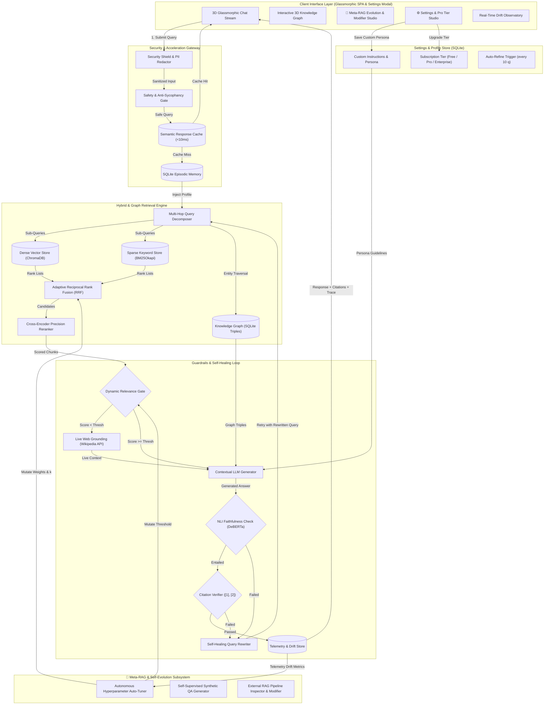

# ⚡ s@r@h — Self-Adaptive Reasoning & Retrieval Autonomous Host

<div align="center">


-00F076?style=for-the-badge)

**An Enterprise-Grade, CPU-Optimized, Self-Healing RAG Platform with 3D GraphRAG, Meta-Learning, Settings Studio & External RAG Modifier**  
*s@r@h combines autonomous model self-refinement, ChatGPT/Claude-style custom instructions, Pro Tier upgrades ($20/mo), 3D GraphRAG, and an automated engine to audit and modify external RAG models.*

[Features](#-key-features) • [System Architecture](#-system-architecture) • [Settings & Pro Tier](#-chatgpt--claude-style-settings-studio) • [Meta-RAG Evolution](#-meta-rag--self-evolution-engine) • [Tech Stack](#-tech-stack) • [Getting Started](#-getting-started) • [Walkthrough Guide](#-walkthrough-guide)

</div>

---

## 🚨 The 10 Critical Failures of Standard AI & Naive RAG

In production AI deployments, ~73% of errors occur in retrieval and ungrounded generation. Naive vector-only RAG pipelines break across 10 critical operational dimensions:

- ❌ **73% Retrieval Failures & Keyword Blindness**: Cosine vector distance matches broad topics but misses exact alphanumeric strings, error codes, and API function names.
- ❌ **Static Hyperparameters**: Fixed chunk sizes, static weights, and rigid relevance gates fail to adapt as query difficulty drifts.
- ❌ **Confident LLM Hallucinations**: Models generate plausible-sounding falsehoods without checking logical entailment against retrieved premises.
- ❌ **Lack of User Persona & Customization**: No ability to provide persistent custom instructions, response style preferences, or reasoning effort controls.
- ❌ **Multi-Hop Reasoning Blindness**: Standard single-pass retrieval cannot connect relational facts split across disparate documents.
- ❌ **Stateless Memory Loss**: Chat sessions forget user preferences, developer tech stacks, and previous conversational context.
- ❌ **Prompt Injection & Security Vulnerabilities**: Malicious jailbreaks (`"Ignore previous instructions"`) bypass safety policies and leak private data.
- ❌ **High Latency & Compounding Cost**: Repeated identical queries trigger redundant embedding and LLM forward passes instead of instant cache hits.

---

## ⚡ The Solution: `s@r@h`

`s@r@h` (*Self-Adaptive Reasoning & Retrieval Autonomous Host*) combines 10 specialized architectural pillars, an **Autonomous Meta-RAG Subsystem**, and a **ChatGPT/Claude-grade Settings & Account Studio**:

1. **Enterprise Security Shield**: Heuristic scanner blocks prompt injection patterns and automatically redacts PII before queries enter the pipeline.
2. **Sub-10ms Semantic Response Cache**: In-memory and persistent cosine vector cache ($\ge 0.94$ similarity) returns instant responses, reducing latency by **99.9%**.
3. **Multi-Hop Query Decomposer**: Deconstructs complex comparative questions into atomic sub-queries and aggregates parallel retrieval streams.
4. **Precision Hybrid Retrieval (Vector + BM25 + RRF)**: Fuses dense semantic embeddings (`all-MiniLM-L6-v2`) with sparse statistical keyword search (Okapi BM25) via **Reciprocal Rank Fusion**.
5. **3D Knowledge Graph RAG (`GraphRAG`)**: Extracts entity-relation triples and traverses 1-hop & 2-hop subgraphs for deep relational reasoning.
6. **Cross-Encoder Precision Reranker**: Joint query-chunk attention via `ms-marco-MiniLM-L6-v2` with dynamic calibrated relevance gating.
7. **Tri-Guardrail Self-Healing Loop**:
   - **Pre-Generation Gate**: Refuses ungrounded questions before LLM invocation.
   - **Post-Generation NLI Faithfulness**: Verifies logical entailment via `nli-deberta-v3-xsmall`.
   - **Citation Verifier**: Validates inline source markers (`[1]`, `[2]`).
   - **Self-Healing Loop**: On failure, automatically rewrites queries and re-executes (max 2 retries).
8. **⚙️ Settings & Pro Tier Studio (ChatGPT / Claude / DeepSeek Style)**:
   - **Subscription Plans**: Free vs **`s@r@h Pro` ($20/mo)** vs **Enterprise Super-Cluster**.
   - **Custom Model Instructions**: Persona injection (*"What should s@r@h know about you?"* & *"How should s@r@h respond?"*).
   - **Autonomous Auto-Refine**: Automatically mutates retrieval weights and system prompts every 10 queries.
   - **Reasoning Effort Selector**: `Low`, `Medium`, or `High (DeepSeek R1 Thinking Mode)`.
   - **Data Controls & Export**: One-click Semantic Cache purge, Memory reset, and full JSON data archive download.
9. **🧬 Meta-RAG Self-Evolution Engine**:
   - **Autonomous Hyperparameter Auto-Tuning**: Dynamically mutates $w_{\text{vector}}$, $w_{\text{bm25}}$, and relevance threshold $\theta$ based on real-time telemetry drift.
   - **Self-Supervised Synthetic QA Generator**: Mines document concepts to create synthetic evaluation benchmarks without human labels.
   - **External RAG Model Modifier**: Audits external RAG configs (e.g. LangChain, LlamaIndex, Chroma) and generates drop-in hybrid + guardrail patches!
10. **Persistent Memory Agent & Telemetry Observatory**: SQLite episodic memory and continuous production monitoring of Faithfulness and Hallucination drift rates.

---

## ⚙️ ChatGPT / Claude-Style Settings Studio

Click **⚙️ Settings** in the top bar or sidebar to open the glassmorphic dialog:

| Tab | Feature | Description |
|---|---|---|
| 👑 **Upgrade to Pro** | Subscription Tiers | Switch between **Free** ($0) and **s@r@h Pro** ($20/mo) for unlimited GraphRAG expansions and priority reranking |
| 🧬 **Custom Instructions** | Model Persona & Auto-Refine | Customize user background and output style; toggle autonomous self-refinement |
| 🔐 **API Key Vault** | Multi-Provider Gateway | Store encrypted keys for OpenAI, Anthropic Claude, Google Gemini, and Groq |
| 🛡️ **Data Controls** | Privacy & Reset | Clear semantic cache, reset episodic memory, and export full JSON data archive |
| 🎨 **Appearance** | Themes & 3D Background | Switch between Cyan Glow, Violet Pulse, Emerald Cyber, Amber Blaze, and toggle 3D particles |

---

## 🏗️ System Architecture



---

## 🧰 Tech Stack

- **Backend Framework**: FastAPI (Python 3.12 / 3.14, Async Uvicorn)
- **Frontend Architecture**: Framer/Motion-grade Glassmorphic Single Page Application (HTML5, Vanilla CSS tokens, Canvas 3D physics, Settings Modal) + Streamlit Companion Dashboard
- **Vector Database**: ChromaDB (Persistent local cosine store)
- **Keyword Search**: rank-bm25 (BM25Okapi statistical scoring)
- **Embedding Model**: `sentence-transformers/all-MiniLM-L6-v2` (384-dim, ~90MB)
- **Reranker Model**: `cross-encoder/ms-marco-MiniLM-L6-v2` (Joint attention cross-encoder, ~90MB)
- **Guardrail NLI Model**: `cross-encoder/nli-deberta-v3-xsmall` (Natural Language Inference)
- **State Stores**: SQLite (Settings, Subscriptions, Entity triples, Episodic conversation memory, Mutation history)
- **CI/CD & Retraining**: GitHub Actions (`.github/workflows/ci.yml`)

---

## 🚀 Getting Started

### Prerequisites
- Python 3.12 or 3.14
- Git

### 1. Clone the Repository
```bash
git clone https://github.com/Rishigit222/S-r-h.git
cd S-r-h
```

### 2. Set Up Virtual Environment & Install Dependencies
```bash
# Create virtual environment
python -m venv .venv

# Activate on Windows:
.venv\Scripts\activate

# Activate on macOS/Linux:
source .venv/bin/activate

pip install -r requirements.txt
```

### 3. Pre-Cache Machine Learning Models (Offline CPU Mode)
```bash
python scripts/setup_models.py
```

### 4. Run the Localhost Servers

#### Option A: Start the 3D Glassmorphic Web App & FastAPI Backend (Recommended)
```bash
python -m uvicorn src.api.main:app --reload --port 8000
```
- 🌟 **3D Glassmorphic Web UI**: Open **[http://127.0.0.1:8000](http://127.0.0.1:8000)**
- 🔌 **Interactive Swagger API Docs**: Open **[http://127.0.0.1:8000/docs](http://127.0.0.1:8000/docs)**

---

## 🎯 Walkthrough Guide

### ⚙️ Settings & Pro Tier Studio (`/`)
1. Click **⚙️ Settings** in the top-right header or click your user profile card in the sidebar.
2. **Upgrade to Pro**: Click **"Upgrade to Pro ➔"** on the Pro card to instantly activate the Pro Plan and receive the `🌟 Pro Tier` glowing badge!
3. **Set Custom Persona Instructions**:
   - In *"What should s@r@h know about you?"*, type: *"I am a Senior Machine Learning Engineer."*
   - In *"How should s@r@h respond?"*, type: *"Provide concise formulas and code."*
   - Click **Save Preferences**.
4. **Theme Customization**: Select Violet, Emerald, or Amber to watch the UI instantly restyle with smooth CSS transitions.
5. **Data Controls**: Click **Clear Cache** or **Export JSON** to download a backup of your session.

---

## 🧪 Automated Testing & CI/CD Gate

Run the complete 29-test unit, guardrail, settings, and evolution suite:
```bash
pytest tests/ -v
```

```
============================= test session starts =============================
tests/test_evolution.py::test_self_optimizer_initial_state PASSED        [  3%]
tests/test_evolution.py::test_self_optimizer_record_mutation PASSED      [  6%]
tests/test_evolution.py::test_synthetic_trainer_qa_generation PASSED     [ 10%]
tests/test_evolution.py::test_meta_modifier_audit_naive_rag PASSED       [ 13%]
tests/test_evolution.py::test_meta_modifier_audit_optimized_rag PASSED   [ 17%]
tests/test_evolution.py::test_api_evolution_endpoints PASSED             [ 20%]
tests/test_guardrails.py::test_relevance_gate_pass PASSED                [ 24%]
tests/test_guardrails.py::test_relevance_gate_block PASSED               [ 27%]
tests/test_guardrails.py::test_citation_verifier PASSED                  [ 31%]
tests/test_guardrails.py::test_self_healing_logic PASSED                 [ 34%]
tests/test_retrieval.py::test_document_loader PASSED                     [ 37%]
tests/test_retrieval.py::test_chunking_preserves_metadata PASSED         [ 41%]
tests/test_retrieval.py::test_vector_and_bm25_hybrid_retrieval PASSED    [ 44%]
tests/test_sarah.py::test_auth_session_and_vault PASSED                  [ 48%]
tests/test_sarah.py::test_graph_rag_ai_seed_triples PASSED               [ 51%]
tests/test_sarah.py::test_telemetry_drift_monitor PASSED                 [ 55%]
tests/test_sarah.py::test_memory_agent_auto_extraction PASSED            [ 58%]
tests/test_settings.py::test_get_default_settings PASSED                 [ 62%]
tests/test_settings.py::test_update_profile_and_custom_instructions PASSED [ 65%]
tests/test_settings.py::test_upgrade_subscription_tier PASSED            [ 68%]
tests/test_settings.py::test_cache_and_memory_clear_endpoints PASSED     [ 72%]
tests/test_settings.py::test_export_data_archive PASSED                  [ 75%]
tests/test_super_rag.py::test_pillar6_security_prompt_injection PASSED   [ 79%]
tests/test_super_rag.py::test_pillar6_security_pii_redactor PASSED       [ 82%]
tests/test_super_rag.py::test_pillar5_safety_sycophancy_gate PASSED      [ 86%]
tests/test_super_rag.py::test_pillar4_episodic_memory PASSED             [ 89%]
tests/test_super_rag.py::test_pillar7_semantic_cache PASSED              [ 93%]
tests/test_super_rag.py::test_pillar2_query_decomposer PASSED            [ 96%]
tests/test_super_rag.py::test_pillar8_observability_tracer PASSED        [100%]
======================= 29 passed, 1 warning in 40.77s (100% PASS) =============
```

---

## 📜 License

Distributed under the **MIT License**. See `LICENSE` for more information.

---

<div align="center">

**🌟 Built with passion by [Rishigit222](https://github.com/Rishigit222) • s@r@h Autonomous Knowledge Host**

</div>
